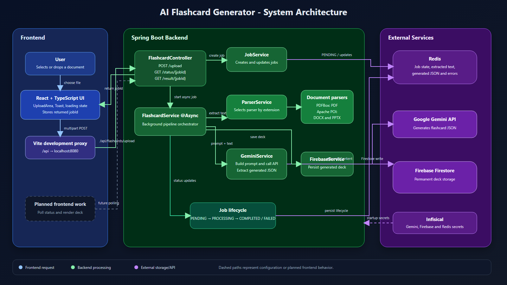

# AI Flashcard Generator

An asynchronous full-stack application that converts PDF, Word, and PowerPoint study material into AI-generated multiple-choice flashcards.

The React frontend accepts a document and sends it to a Spring Boot API. The backend creates a Redis-backed job, extracts text with a format-specific parser, asks Google Gemini to generate structured flashcards, stores the generated deck in Firebase Firestore, and exposes endpoints for checking job status and retrieving results.

> Current status: document upload and job creation are connected end to end. The frontend stores the returned job ID; status polling and flashcard deck rendering are planned next.

## Architecture



The editable diagrams.net source is available at [docs/architecture.drawio](docs/architecture.drawio). Open it in [draw.io](https://app.diagrams.net/) to modify the architecture. A scalable rendered version is also available at [docs/architecture.svg](docs/architecture.svg).

## Processing Flow

1. The user selects or drops a supported document in the React UI.
2. React creates `FormData` and sends `POST /api/flashcards/upload`.
3. Vite proxies `/api` requests to Spring Boot at `http://localhost:8080` during development.
4. `FlashcardController` creates a job through `JobService`.
5. Redis stores the job with `PENDING` status.
6. `FlashcardService` starts asynchronous processing and changes the job to `PROCESSING`.
7. `ParserService` selects the matching document parser.
8. PDFBox or Apache POI extracts the document text.
9. `GeminiService` sends the extracted text and flashcard prompt to Google Gemini.
10. The generated JSON is attached to the Redis job and saved to Firestore.
11. The job becomes `COMPLETED`, or `FAILED` if processing throws an exception.
12. API clients can check status and retrieve the completed flashcard deck.

## Tech Stack

### Frontend

| Technology | Purpose |
|---|---|
| React 19 | Component-based user interface |
| TypeScript 6 | Static types for UI state, props, and API responses |
| Vite 8 | Development server, build tool, and `/api` proxy |
| CSS | Responsive upload interface, drag feedback, loading states, and toast notifications |

### Backend

| Technology | Purpose |
|---|---|
| Java 21 | Backend language |
| Spring Boot 3.2 | REST API, dependency injection, configuration, and application runtime |
| Spring Web / `RestClient` | HTTP endpoints and Gemini API calls |
| Spring `@Async` | Background flashcard-generation jobs |
| Spring Data Redis | Temporary job state and processing results |
| Jackson | JSON parsing and response mapping |
| Lombok | Reduced Java model and service boilerplate |

### AI And Document Processing

| Technology | Purpose |
|---|---|
| Google Gemini API | Generates multiple-choice flashcards from extracted text |
| Apache PDFBox | Extracts text from PDF documents |
| Apache POI | Extracts text from DOCX and PPTX documents |

### Data And Configuration

| Technology | Purpose |
|---|---|
| Redis | Stores `PENDING`, `PROCESSING`, `COMPLETED`, and `FAILED` jobs |
| Firebase Firestore | Permanent flashcard deck storage when configured |
| Infisical | Loads Gemini, Firebase, and Redis secrets at application startup |

## Current Features

- Click-to-select and drag-and-drop document input
- Modern responsive upload UI
- File-extension validation
- Selected file name and size display
- Timed success and error notifications
- Multipart document upload
- Asynchronous backend processing
- Redis job lifecycle tracking
- PDF, Word, and PowerPoint text extraction
- Gemini-generated flashcard JSON
- Optional Firestore persistence
- Status and result REST endpoints

## API

Base path: `/api/flashcards`

### Upload A Document

```http
POST /api/flashcards/upload
Content-Type: multipart/form-data
```

Multipart field:

```text
file=<document>
```

Response:

```json
{
  "jobId": "d5473e1d-06e8-4ef2-8478-c91ec166a2b8"
}
```

### Check Job Status

```http
GET /api/flashcards/status/{jobId}
```

Example response:

```json
{
  "jobId": "d5473e1d-06e8-4ef2-8478-c91ec166a2b8",
  "status": "PROCESSING",
  "fileName": "study-notes.pdf",
  "error": null
}
```

Possible statuses:

- `PENDING`
- `PROCESSING`
- `COMPLETED`
- `FAILED`

### Retrieve Flashcards

```http
GET /api/flashcards/result/{jobId}
```

The endpoint returns `409 Conflict` until the job is `COMPLETED`.

Example completed response:

```json
{
  "jobId": "d5473e1d-06e8-4ef2-8478-c91ec166a2b8",
  "fileName": "study-notes.pdf",
  "flashcards": [
    {
      "question": "What problem does dependency injection solve?",
      "answer": "It supplies object dependencies without requiring objects to construct them.",
      "explanation": "This reduces coupling and improves testability.",
      "distractors": [
        "It compiles Java into bytecode",
        "It stores application logs",
        "It replaces HTTP"
      ],
      "incorrectExplanations": [
        "Compilation is handled by the Java compiler.",
        "Logging is a separate concern.",
        "Dependency injection does not replace networking."
      ],
      "difficulty": "medium",
      "tags": ["spring", "dependency-injection"],
      "cognitiveLevel": "understand",
      "confidence": 0.95,
      "sourceSnippet": "Dependencies are supplied to a class by the framework."
    }
  ]
}
```

## Local Development

### Prerequisites

- Java 21
- Maven 3.9+
- Node.js and npm
- Redis running at `redis://localhost:6379`, or a configured `REDIS_URL`
- A Gemini API key
- Optional Firebase service-account JSON
- Optional Infisical project credentials

### Environment Variables

The application can load these values from Infisical:

```text
INFISICAL_CLIENT_ID
INFISICAL_CLIENT_SECRET
INFISICAL_PROJECT_ID
```

Infisical maps application secrets including:

```text
GEMINI_API_KEY
FIRE_BASE_SERVICE_ACCOUNT_JSON
REDIS_URL
```

For local development without Infisical, provide Spring-compatible environment properties directly. At minimum, configure the Gemini API key and Redis connection.

### Start Redis

Run Redis locally on port `6379`. For example, with Docker:

```powershell
docker run --name flashcard-redis -p 6379:6379 redis:7
```

### Start The Backend

This repository does not currently include the Maven wrapper, so use an installed Maven:

```powershell
mvn spring-boot:run
```

The API starts at:

```text
http://localhost:8080
```

### Start The Frontend

```powershell
cd frontend
npm install
npm run dev
```

Vite prints the local frontend URL, normally:

```text
http://localhost:5173
```

Restart the Vite server after changing `vite.config.ts`.

## Project Structure

```text
flash-card-generator/
├── docs/
│   ├── architecture.drawio
│   ├── architecture.png
│   └── architecture.svg
├── frontend/
│   ├── src/
│   │   ├── App.tsx
│   │   ├── UploadArea.tsx
│   │   └── Toast.tsx
│   └── vite.config.ts
├── src/main/java/com/flashcard/
│   ├── config/
│   ├── controller/
│   ├── model/
│   ├── parser/
│   └── service/
├── src/main/resources/application.properties
├── tasks/
│   ├── ai-learning-progress.md
│   ├── ai-roadmap.md
│   └── react-ui-progress-2026-06-12.md
└── pom.xml
```

## Current Limitations

- The frontend does not yet poll job status or display the generated deck.
- Gemini output is still handled as raw JSON text before later conversion.
- Full structured output validation and AI guardrails are planned.
- Firestore save failures are currently logged inside `FirebaseService`; failure propagation needs hardening.
- The UI mentions a 25 MB limit while Spring Boot currently enforces 20 MB.
- Server-side MIME/content validation is not implemented yet.
- DOCX and PPTX are the parser implementations currently verified by the selected Apache POI APIs; legacy DOC/PPT support needs explicit testing.
- Automated backend tests and production deployment configuration are incomplete.

## Planned Work

### Frontend

- Poll job status
- Display processing, completed, and failed states
- Retrieve and render the flashcard deck
- Add retry, replace, remove, and accessibility improvements

### AI Engineering

- Parse Gemini output into `List<Flashcard>`
- Validate every generated card
- Add prompt versioning and token budgets
- Build evaluation datasets and regression tests
- Add document chunking
- Add embeddings, vector search, and production RAG
- Add grounded Ask My Document functionality
- Add tool calling, agents, skills, and MCP after deterministic foundations

The complete learning and production plan is maintained in [tasks/ai-roadmap.md](tasks/ai-roadmap.md).

## Build Checks

Frontend:

```powershell
cd frontend
npm run lint
npm run build
```

Backend:

```powershell
mvn test
```
